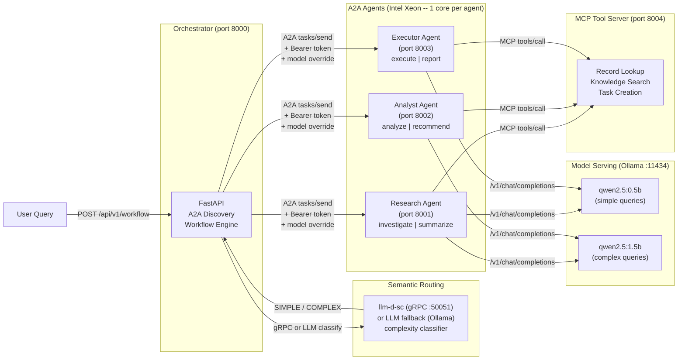

# Build multi-agent AI systems with open protocols

Deploy cooperating AI agents with semantic routing, MCP tool calling, and inter-agent auth on Red Hat OpenShift AI.

## Table of Contents

- [Overview](#overview)
- [Who is this for](#who-is-this-for)
- [Example use cases](#example-use-cases)
- [Detailed description](#detailed-description)
  - [Architecture diagrams](#architecture-diagrams)
- [Requirements](#requirements)
  - [Minimum hardware requirements](#minimum-hardware-requirements)
  - [Minimum software requirements](#minimum-software-requirements)
  - [Required user permissions](#required-user-permissions)
- [Deploy](#deploy)
  - [Prerequisites](#prerequisites)
  - [Installation](#installation)
  - [Validating the deployment](#validating-the-deployment)
  - [Delete](#delete)
- [Customizing for your domain](#customizing-for-your-domain)
- [Repository structure](#repository-structure)
- [References](#references)
- [Tags](#tags)

## Overview

Building multi-agent AI systems requires coordinating several concerns: agent discovery, intelligent routing, tool access, authentication, and multi-model orchestration. This quickstart is a domain-agnostic template that demonstrates all five patterns using open protocols. It ships with three example agents (research, analyst, executor) and generic MCP tools that work out of the box. Customize the agent definitions, tools, and demo data to build a multi-agent system for any domain -- healthcare, finance, DevOps, support, or anything else -- on Red Hat OpenShift AI with Intel Xeon processors.

## Who is this for

- **AI engineers** learning agentic patterns: A2A discovery, semantic routing, MCP tool calling, inter-agent auth, and multi-model selection.
- **Solution architects** designing multi-agent platforms that need a working reference implementation to start from.
- **System integrators** building interoperable AI services that communicate through open protocols like A2A, MCP, and JSON-RPC 2.0.
- **DevOps teams** deploying cooperative AI agent workloads on Red Hat OpenShift AI with Intel Xeon processors.

## Example use cases

- **DevOps incident response** -- Research agent investigates an alert, analyst identifies root cause, executor applies the fix and creates follow-up tasks.
- **Customer support routing** -- Classify ticket complexity, pull relevant knowledge base articles, route to the right team with context.
- **Financial analysis** -- Research market data, analyze trends and risks, execute trades or generate reports.
- **Healthcare coordination** -- Triage patients, generate clinical recommendations, schedule follow-ups with MCP-backed EHR tools.
- **Content pipeline** -- Research topics, analyze audience fit, execute publishing and distribution.

## Detailed description

This quickstart decomposes a multi-step workflow into three independent agents -- research, analyst, and executor -- that communicate through the open A2A protocol. Each agent publishes a machine-readable agent card at `/.well-known/agent-card.json` describing its capabilities and skills. The orchestrator discovers agents automatically, maintains a live registry, and delegates tasks through JSON-RPC 2.0 calls.

Before executing a workflow, the orchestrator classifies the query's complexity (SIMPLE, MEDIUM, COMPLEX, REASONING) and uses this signal to make two decisions: (1) workflow depth -- simple queries route only to the executor, moderate queries add research, and complex cases invoke the full research-analyst-executor pipeline; (2) model tier -- simple queries use the fast `qwen2.5:0.5b` model while complex queries use the more capable `qwen2.5:1.5b`. Classification uses llm-d-sc (a low-latency Rust semantic classifier from the llm-d project, sub-20ms on CPU) when available, and falls back to LLM-based classification via Ollama when it isn't -- so semantic routing works in both local and OpenShift deployments.

Agents call an MCP (Model Context Protocol) tool server during task processing. Three generic tools are available: record lookup, knowledge base search, and task creation. When a query mentions records, searches, or task assignments, the relevant tools fire automatically and their results are woven into the agent's response. Replace these with your own domain-specific tools to customize.

A bearer token authentication middleware secures inter-agent communication on the `/a2a` endpoint while keeping health checks and agent card discovery open for Kubernetes probes and A2A protocol compliance. In production, replace the shared token with OpenShift service account tokens or mTLS.

The entire stack runs on Intel Xeon processors. Multi-agent workloads benefit from Xeon's core isolation -- each agent is pinned to a dedicated core so inference on one agent does not contend with another, giving predictable per-request latency. The llm-d-sc classifier uses the Candle inference runtime (Rust + BERT), which leverages Xeon's AVX-512 vector extensions for fast embedding computation without a GPU. Ollama serves both Qwen models on CPU, taking advantage of Xeon's large memory bandwidth and cache hierarchy for quantized LLM inference. This architecture demonstrates that production-grade multi-agent systems can run entirely on CPU when workloads are sized appropriately.

A demo mode is available for evaluation and development without LLM backends. All responses carry an AI disclaimer.

### Architecture diagrams




## Requirements

This quickstart runs locally on CPU or on Red Hat OpenShift. Choose the path that fits your goal.

|  | Local (laptop / dev server) | OpenShift (production-like) |
|---|---|---|
| **Purpose** | Learn, develop, demo | Deploy, integrate, scale |
| **Hardware** | 4 CPU cores, 8 GiB memory | 6+ CPU cores, 12 GiB memory |
| **Software** | Python 3.9+, Ollama | OpenShift 4.14+, Helm 3.12+ |
| **Models** | Ollama serves both locally | Ollama in-cluster or external MaaS |
| **Semantic routing** | LLM-based fallback (uses Ollama) | llm-d-sc (sub-20ms) + LLM fallback |
| **Sandboxing** | Process-level isolation | Pod SecurityContext, restricted profiles |
| **Auth** | Shared bearer token (optional) | K8s Secrets, service account tokens |
| **Tracing** | Log-based latency tracking | Per-step latency in workflow response |
| **Time to first workflow** | ~2 minutes | ~10 minutes |

### Minimum hardware requirements

- **Local:** 4 CPU cores (Intel Xeon recommended), 8 GiB memory, 3 GiB storage
- **OpenShift:** 6 CPU cores, 12 GiB memory, 8 GiB storage (includes llm-d-sc + model artifacts)

### Minimum software requirements

- **Local:** Python 3.9+, Ollama (optional -- demo mode works without it), Podman 4.0+ (optional for container mode)
- **OpenShift:** Red Hat OpenShift 4.14+ or OpenShift AI 2.7+, Helm 3.12+, `oc` CLI 4.14+

### Required user permissions

This quickstart can be deployed by a regular user with namespace-level permissions.

## Deploy

### Prerequisites

- Access to a Red Hat OpenShift cluster (Option 2) or a local machine with Python 3.9+ (Option 1)
- Ollama installed locally for LLM inference (optional -- demo mode works without it)
- `helm` and `oc` CLI tools installed (OpenShift only)

### Option 1: Run locally

Best for learning, development, and demos. Runs all services as local Python processes on CPU.

```bash
git clone https://github.com/rh-ai-quickstart/multi-agent-quickstart.git
cd multi-agent-quickstart

# One command -- detects Ollama, pulls models, starts everything
./demo.sh
```

What starts:
- 3 A2A agents (research, analyst, executor) on ports 8001-8003
- MCP tool server on port 8004
- Orchestrator on port 8000
- Gradio UI on port 7860 (requires Python 3.10+)
- Ollama serving qwen2.5:0.5b + qwen2.5:1.5b (if available; falls back to demo mode)

Verify:

```bash
curl http://localhost:8000/health
curl -X POST http://localhost:8000/api/v1/workflow \
  -H "Content-Type: application/json" \
  -d '{"query": "Investigate the API error spike and create a fix task"}'
```

**Local with containers** (closer to production):

```bash
cp .env.example .env
podman compose up -d
# Pulls both Ollama models + llm-d-sc classifier on first start
```

Stop:

```bash
# demo.sh: Ctrl+C
# compose: podman compose down -v
```

### Option 2: Deploy to Red Hat OpenShift

Best for production-like deployment, integration with OpenShift AI platform services, and team demos.

```bash
git clone https://github.com/rh-ai-quickstart/multi-agent-quickstart.git
cd multi-agent-quickstart

# Create project
oc new-project multi-agent-quickstart

# Deploy with Helm
helm install multi-agent-quickstart chart/
```

What you get on OpenShift that you don't get locally:

- **Sandboxed agents** -- each agent pod runs with `readOnlyRootFilesystem`, dropped capabilities, and non-root user via SecurityContext
- **Semantic routing** -- llm-d-sc runs as a containerized service with its own Deployment and ClusterIP Service; the orchestrator routes queries through it automatically
- **Secret-based auth** -- set `auth.enabled: true` in values.yaml to inject bearer tokens via K8s Secrets instead of environment variables
- **Health probes** -- liveness and readiness probes on every service for automatic restart and traffic management
- **Intel Xeon core pinning** -- CPU requests/limits per agent (1 core per agent) ensure dedicated compute with no noisy-neighbor contention; configurable in values.yaml

Customize the deployment:

```bash
# Enable agent authentication
helm upgrade multi-agent-quickstart chart/ --set auth.enabled=true

# Disable semantic routing (if not using llm-d-sc)
helm upgrade multi-agent-quickstart chart/ --set semanticRouter.enabled=false

# Use your own model endpoint (MaaS)
helm upgrade multi-agent-quickstart chart/ \
  --set model.endpoint=https://my-maas:443 \
  --set model.name=my-model
```

Verify:

```bash
oc get pods
ROUTE_URL="https://$(oc get route multi-agent-quickstart -o jsonpath='{.spec.host}')"
curl "$ROUTE_URL/health"
curl -X POST "$ROUTE_URL/api/v1/workflow" \
  -H "Content-Type: application/json" \
  -d '{"query": "Investigate the API error spike, analyze root cause, and fix it"}'
```

### Validating either deployment

```bash
# Check system health and semantic routing status
curl http://localhost:8000/health

# List discovered agents
curl http://localhost:8000/api/v1/agents

# Run a simple query (lightweight workflow -- executor only)
curl -X POST http://localhost:8000/api/v1/workflow \
  -H "Content-Type: application/json" \
  -d '{"query": "Create a task to review the deployment", "workflow_type": "lightweight"}'

# Run a complex query (comprehensive workflow -- all 3 agents)
curl -X POST http://localhost:8000/api/v1/workflow \
  -H "Content-Type: application/json" \
  -d '{"query": "Investigate the API error spike, analyze root cause, and fix it"}'

# Check MCP tools
curl http://localhost:8004/health
```

### Delete

```bash
# Local compose
podman compose down -v

# OpenShift
helm uninstall multi-agent-quickstart
oc delete project multi-agent-quickstart
```

## Customizing for your domain

This quickstart is designed to be forked and customized. Three files define the domain:

1. **`src/agent.py`** -- Edit `AGENT_CONFIGS` to define your agent names, skills, and descriptions. Edit `DEMO_RESPONSES` to provide domain-specific demo responses. The A2A protocol, MCP integration, and auth work unchanged.

2. **`src/mcp_server.py`** -- Replace the three example tools (`lookup_record`, `search_knowledge_base`, `create_task`) with your domain tools. Keep the MCP JSON-RPC contract (`tools/list`, `tools/call`) and add your own data sources.

3. **`docker-compose.yml` / `chart/values.yaml`** -- Rename services and update environment variables to match your agent names.

Everything else -- the orchestrator, semantic router, auth middleware, Gradio UI, test framework, and Helm templates -- works for any domain without modification.

**Example: building a support ticket system.** To turn this into a support ticket agent:

```python
# In src/agent.py, replace the AGENT_CONFIGS entry:
AGENT_CONFIGS = {
    "classifier": {
        "description": "Classifies incoming support tickets by category and urgency.",
        "skills": [
            AgentSkill(id="classify", name="Classify Ticket", description="..."),
        ],
    },
    "resolver": {
        "description": "Suggests resolutions by searching past tickets and KB articles.",
        "skills": [
            AgentSkill(id="resolve", name="Suggest Resolution", description="..."),
        ],
    },
    "dispatcher": {
        "description": "Assigns tickets to the right team and sends notifications.",
        "skills": [
            AgentSkill(id="dispatch", name="Dispatch Ticket", description="..."),
        ],
    },
}

# In src/mcp_server.py, replace the tools:
# - lookup_ticket(ticket_id) -- fetch from your ticket system API
# - search_past_resolutions(keywords) -- search resolved ticket history
# - assign_ticket(ticket_id, team) -- assign via your ticketing API

# In docker-compose.yml, rename the services:
# research-agent -> classifier-agent, analyst-agent -> resolver-agent, etc.
```

The orchestrator, semantic routing, auth, and UI work unchanged -- they only care about agent names and the A2A protocol, not what the agents do internally.

## Repository structure

```
.
├── .env.example              # Environment variable template
├── .github/
│   └── workflows/
│       └── ci.yaml           # GitHub Actions CI pipeline
├── chart/                    # Helm chart for OpenShift deployment
│   ├── Chart.yaml
│   ├── values.yaml
│   └── templates/
│       ├── orchestrator-deployment.yaml
│       ├── agent-deployments.yaml
│       ├── mcp-server-deployment.yaml
│       ├── semantic-router-deployment.yaml
│       └── test-model-access.yaml
├── contracts/                # API contracts (OpenAPI)
│   └── openapi/
│       ├── orchestrator.yaml
│       ├── agent.yaml
│       └── mcp.yaml
├── docs/images/              # Architecture diagrams and screenshots
├── src/                      # Application source code
│   ├── orchestrator.py       # Orchestrator with semantic routing
│   ├── agent.py              # A2A agent with MCP tool calling (customize this)
│   ├── models.py             # Pydantic models for A2A protocol
│   ├── auth.py               # Bearer token auth middleware
│   ├── mcp_server.py         # MCP tool server (customize this)
│   ├── ui.py                 # Gradio UI
│   ├── classify_pb2.py       # Generated gRPC stubs (llm-d-sc)
│   ├── classify_pb2_grpc.py  # Generated gRPC client (llm-d-sc)
│   ├── Containerfile         # Container image definition
│   └── requirements.txt      # Python dependencies
├── tests/                    # CDD -> TDD -> EDD validation
├── docker-compose.yml        # Local dev stack
├── demo.sh                   # One-command launcher
├── Makefile                  # Test targets: make test-all
├── LICENSE
└── README.md
```

## References

- [A2A Protocol Specification](https://google.github.io/A2A/) -- Open protocol for agent-to-agent discovery, delegation, and task management.
- [llm-d-sc Semantic Classifier](https://github.com/llm-d-incubation/llm-d-semantic-classifier) -- Low-latency Rust service for semantic classification of inference requests, part of the llm-d project.
- [Model Context Protocol (MCP)](https://modelcontextprotocol.io/) -- Open protocol for connecting AI models to external tools and data sources.
- [Intel Xeon for Multi-Service Workloads](https://www.intel.com/content/www/us/en/products/details/processors/xeon.html) -- Core-per-agent isolation and predictable performance for AI services.
- [Red Hat OpenShift AI Documentation](https://docs.redhat.com/en/documentation/red_hat_openshift_ai_self-managed/) -- Enterprise AI platform for deploying and managing AI workloads.
- [FastAPI Documentation](https://fastapi.tiangolo.com/) -- High-performance Python web framework for building APIs.
- [JSON-RPC 2.0 Specification](https://www.jsonrpc.org/specification) -- Lightweight remote procedure call protocol used by A2A.
- [Ollama](https://ollama.com/) -- Local LLM serving with OpenAI-compatible API.

## Tags

- **Title:** Build multi-agent AI systems with open protocols
- **Description:** Deploy cooperating AI agents with semantic routing, MCP tool calling, and inter-agent auth on Red Hat OpenShift AI.
- **Industry:** Media and IT services
- **Product:** Red Hat OpenShift AI
- **Use case:** AI inference
- **Partner:** Intel
- **Contributor org:** Red Hat
