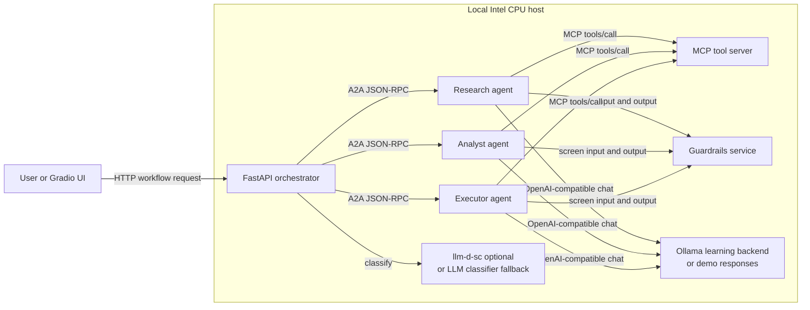
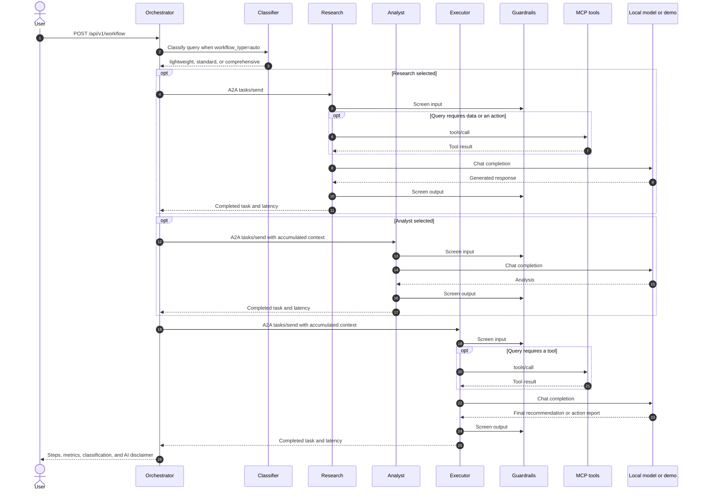
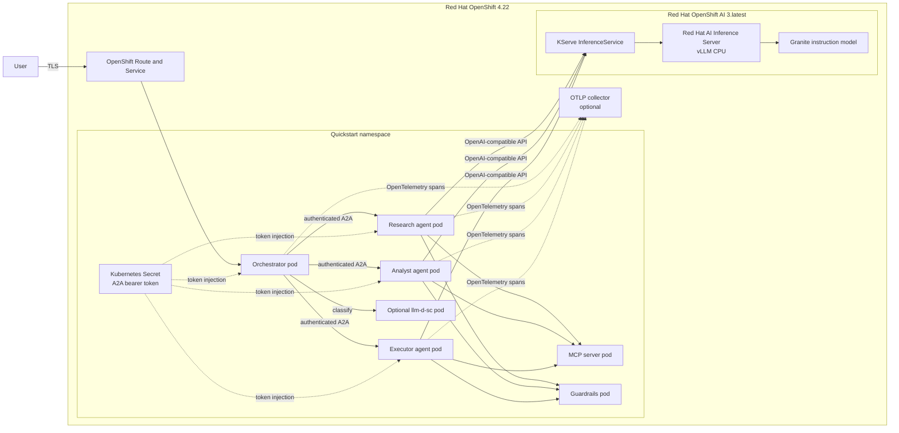
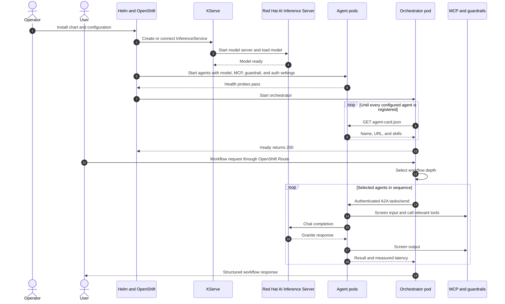
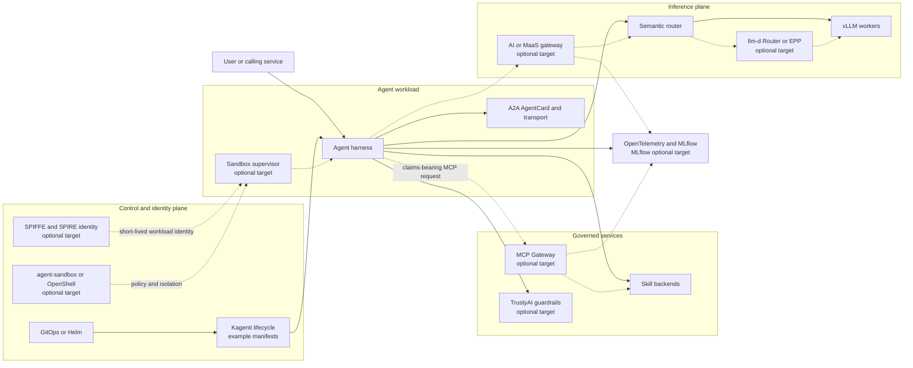
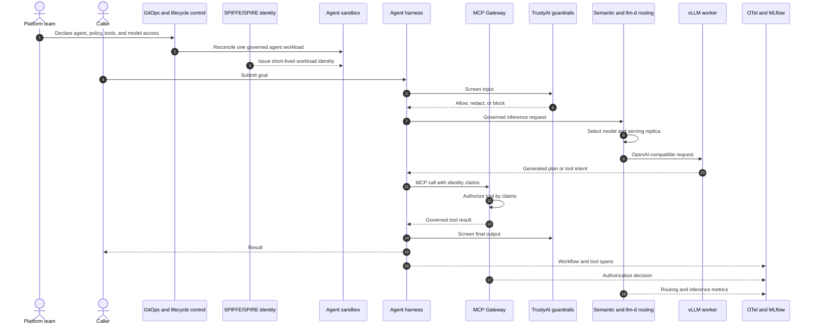

# Compare the three quickstart tracks

The three tracks teach the same agent workflow at increasing levels of platform integration. Track 1 proves the application pattern locally. Track 2 runs that pattern on Red Hat OpenShift AI. Track 3 maps the pattern to the open cloud-native agent blueprint and identifies optional advanced integrations; it is not an end-to-end validated deployment.

## Track 1: Local learning architecture

### Track 1 request event flow

## Track 2: OpenShift AI architecture

### Track 2 deployment and request event flow

## Track 3: Advanced blueprint mapping

Track 3 is a target architecture and exploration path. Solid connections below are represented by the current quickstart or its example manifests. Dashed connections are advanced blueprint integrations that require additional platform components and validation.

### Track 3 governed event flow

## What changes between tracks

| Concern | Track 1 | Track 2 | Track 3 |
|---|---|---|---|
| Purpose | Learn and inspect the agent pattern | Run and validate it on OpenShift AI | Explore the full blueprint and governance boundaries |
| Runtime | Local processes or Compose | Pods, Services, Route, Helm, and KServe | Agent lifecycle and sandbox control planes |
| Inference | Ollama or simulated responses | Red Hat AI Inference Server or MaaS | Governed gateway, semantic routing, llm-d, and vLLM workers |
| Identity | Optional shared bearer token | Kubernetes Secret-backed bearer token | Short-lived SPIFFE/SPIRE workload identity target |
| Tools | Direct MCP calls | Direct in-cluster MCP calls | Claims-authorized MCP Gateway target |
| Isolation | Local process boundary | Hardened pod SecurityContext | OpenShell or agent-sandbox and optional Kata target |
| Evidence level | Automated local and demo validation | Live sequential Intel CPU validation | Architecture mapping; not end-to-end validated |
